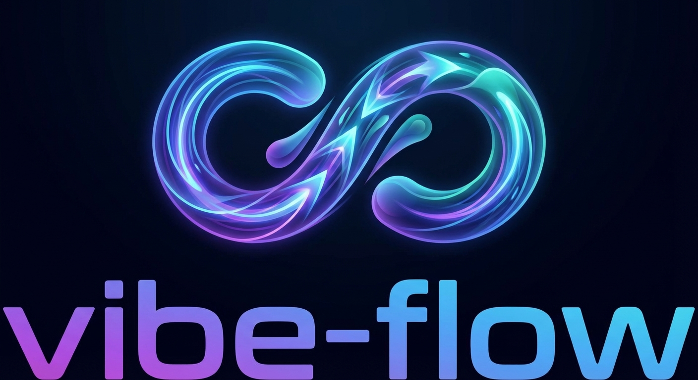

<p align="center">
  
</p>

**Stop vibe coding. Start vibe *shipping*.**

A skills pack for [Claude Code](https://docs.anthropic.com/en/docs/claude-code) that transforms chaotic AI-assisted development into a structured, repeatable workflow. Go from idea to deployed feature without losing context, scope, or your mind.

## The Problem

You start building a feature with Claude. Three hours later you're debugging something unrelated, the original requirements are forgotten, and you have 47 uncommitted files. Sound familiar?

## The Solution

vibe-flow enforces a proven product development workflow:

```
/prd        →  Interview-driven requirements (you're the product owner)
/research   →  Technical analysis before coding starts
/phase      →  Phased plan with tasks and acceptance criteria
/implement  →  Execute one phase at a time with review cycles
/continue   →  Pick up exactly where you left off
```

Each step creates artifacts in `.plans/<feature>/` that persist across sessions. No more "what was I building again?"

## Installation

```bash
git clone https://github.com/jasich/vibe-flow.git
cd vibe-flow
./install.sh
```

Skills are symlinked to `~/.claude/skills/` — available in every project.

## The Workflow

### 1. Define what you're building

```
> /prd user-notifications
```

Claude interviews you like a product manager. No assumptions — just questions until the PRD is complete. You approve each section before it's written.

### 2. Research before you code

```
> /research user-notifications
```

Claude analyzes your codebase, identifies existing patterns to reuse, finds gaps, and assesses risks. Pure research — no decisions yet.

### 3. Plan in phases

```
> /phase user-notifications
```

Claude proposes implementation phases. You adjust scope, ordering, and priorities. Each phase gets acceptance criteria and a task checklist.

### 4. Build incrementally

```
> /implement user-notifications
```

Claude shows you the phase, confirms you're ready, then implements. After each phase: review, test suggestions, and commit prompt. Then onto the next phase.

### 5. Resume anytime

```
> /continue user-notifications
```

Context window expired? Claude analyzes uncommitted changes, figures out where you stopped, and picks up seamlessly.

## What Gets Created

```
.plans/user-notifications/
├── PRD.md       # What you're building and why
├── RESEARCH.md  # Technical analysis and decisions
└── PLAN.md      # Phases with checkboxes (tracks progress)
```

Commit these with your code. They're documentation *and* resumable state.

## Configuration

Default plans directory is `.plans/` (project-local). Override globally:

```bash
# In your .zshrc or .bashrc
export VIBE_FLOW_PLANS_DIR=~/plans
```

## Tips

**Skip the feature name** — If you're on a feature branch, just run `/implement` with no argument. It'll use your current branch name to find the plans.

```
> git checkout user-notifications
> /implement
# Finds plans at .plans/user-notifications/
```

## Why This Works

- **No assumptions** — Claude asks instead of guessing
- **Phased delivery** — Ship working increments, not half-finished features
- **Review cycles** — You approve before Claude moves on
- **Persistent context** — Plans survive session boundaries
- **Version controlled** — Track decisions alongside code

## License

MIT
